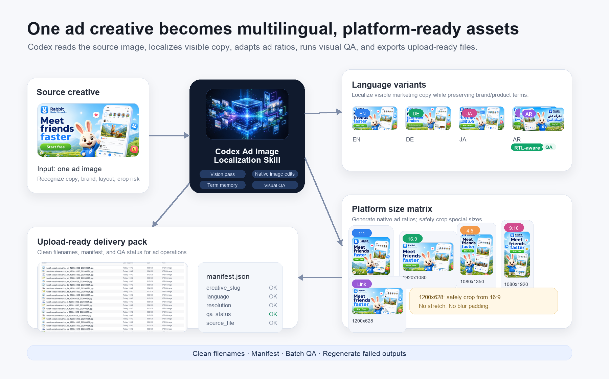
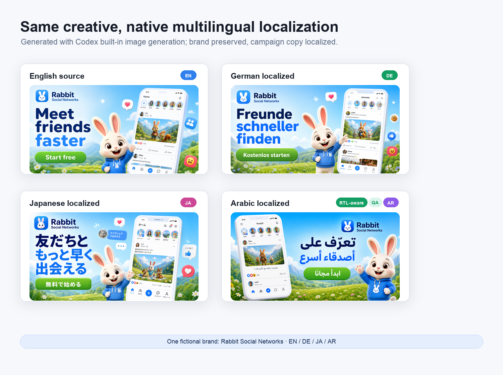

# Ad Image Localization Codex Skill

**Localize image creatives with Codex built-in image generation. No extra image API required.**

[中文说明](./README.zh-CN.md) · [Installation](./install.md) · [Skill](./SKILL.md) · [License](./LICENSE)

Ad Image Localization is a Codex skill for turning source image creatives into localized, platform-ready ad and social assets. It is designed for marketers, UA teams, ecommerce operators, and creators who need multilingual creative variants without setting up a separate image-generation API.



## Why This Skill

- **Uses your Codex subscription quota** for image generation and editing.
- **No extra API setup**: no image API key, no separate billing account, no external generation service required.
- **Native visual output**: relies on Codex built-in vision, image generation, and image editing instead of simple masking or mechanical text replacement.
- **Campaign-ready workflow**: standardized filenames, manifests, common ad sizes, visual QA, and Cultural Aware Check before delivery.
- **Good long-running value**: slower than a dedicated batch API, but low setup cost and strong output quality make it useful for marketing teams that can let jobs run in the background.

## Tradeoff

The built-in Codex image workflow is slower than purpose-built bulk image APIs. This skill is optimized for convenience, native visual quality, and low setup cost rather than maximum throughput.

Future work may include a separate high-throughput skill based on the Nano Banana API for faster batch production.

## What It Does

- Translates visible text inside images into target languages.
- Uses RTL-aware localization by default for Arabic and other RTL languages, with copy-only fallback when QA finds the adapted layout weaker.
- Preserves brand names, product names, logos, subjects, and visual hierarchy.
- Adapts creatives into common ad/social sizes:
  - `1200x1200`
  - `1920x1080`
  - `1080x1350`
  - `1080x1920`
  - `1200x628`
- Handles special resolutions by generating the closest safe aspect ratio, then applying deterministic cover-crop when appropriate.
- Maintains brand/product terminology memory.
- Produces clean upload-ready filenames and manifests.
- Runs visual QA before delivery, with one regeneration pass for failed outputs.
- Runs Cultural Aware Check during QA and moves potentially sensitive outputs into `Flagged by Cultural Aware/` for user review.
- Includes a deterministic helper script for safe crop, manifests, filename/dimension checks, QA contact sheets, cultural flagging, and terminology memory updates.


## How It Is Different

This is not a general image translation tool.

Most image translation projects focus on OCR, text removal, translation, and re-rendering. This skill focuses on **ad creative localization delivery**: translating in-image copy, preserving brand/product terms, adapting to common ad sizes, generating upload-ready filenames, writing manifests, and running visual QA inside a Codex workflow.



For Arabic and other RTL languages, the skill first attempts RTL-aware layout adaptation, and falls back to copy-only localization if QA determines the adapted layout is weaker.

## RTL-aware Localization

For Arabic and other right-to-left languages, the skill uses a quality-first fallback strategy: try RTL-aware localization first, then fall back to copy-only localization when the adapted layout is less natural, less readable, or less brand-safe.


- **Option A: RTL-aware enabled (default for RTL languages)**: adapts layout for right-to-left reading when beneficial, including text direction, alignment, CTA flow, local text grouping, and limited UI or dialogue layout adjustments.
- **Option B: RTL-aware disabled / fallback**: translates visible copy only and preserves the original layout structure when layout adaptation reduces quality.

Use Option A by default for Arabic and other RTL languages. Use Option B when layout adaptation makes the creative feel unbalanced, damages brand recognition, or produces weaker text layout. RTL-aware localization is not a request to mirror the entire design, flip logos, or move brand identity without a clear visual reason.

## Cultural Aware Check

During QA, the skill also checks whether a localized creative may create cultural, legal, religious, social, or political risk in the target market. This is a review flag, not automatic creative editing and not legal advice.

Examples of things the check may consider include religious sensitivity, regulated claims, disputed borders or maps, political symbols, gestures, food or animal symbolism, modesty norms, and local advertising restrictions. It does not use a fixed blacklist; the judgment depends on the creative, language, target market, and product category. When the risk depends on current market rules or political context, Codex should search for current sources before flagging.

If a variant is flagged, the skill moves the affected files into:

```text
Flagged by Cultural Aware/
```

The user should review those files before launch or ask Codex to create a safer revision. The skill does not modify flagged creatives unless the user explicitly asks.

## Helper Script

The bundled Python helper handles deterministic last-mile work. It does **not** call an image API and does not replace Codex built-in image generation.

```bash
python -m pip install -r requirements.txt
python scripts/ad_image_localization_tools.py cover-crop input.png output.jpg --size 1200x628
python scripts/ad_image_localization_tools.py manifest localized_output/
python scripts/ad_image_localization_tools.py verify localized_output/
python scripts/ad_image_localization_tools.py contact-sheet localized_output/ qa_contact_sheet.jpg
python scripts/ad_image_localization_tools.py flag-cultural localized_output/ rabbit-social-networks_ar_1200x628_20260622.jpg --market "GCC" --reason "Needs local cultural review"
python scripts/ad_image_localization_tools.py memory-add brand_term_memory.json --brand openai --term Codex --action preserve
```

Use it after model-native generation for repeatable safe cropping, upload-ready manifests, filename/dimension checks, visual QA sheets, Cultural Aware flagging, and brand/product terminology memory. The helper uses Pillow; install it with `python -m pip install -r requirements.txt` when running outside Codex bundled Python environments.

Local helper tests:

```bash
python -m pip install -r requirements.txt
python -m unittest discover -s tests
```

## Installation

Install directly into your Codex skills directory:

```bash
mkdir -p "${CODEX_HOME:-$HOME/.codex}/skills"
git clone https://github.com/kouzt123/ad-image-localization-codex \
  "${CODEX_HOME:-$HOME/.codex}/skills/ad-image-localization"
```

If you prefer to clone elsewhere, symlink the whole repo:

```bash
git clone https://github.com/kouzt123/ad-image-localization-codex ~/Developer/ad-image-localization-codex
mkdir -p "${CODEX_HOME:-$HOME/.codex}/skills"
ln -sfn ~/Developer/ad-image-localization-codex \
  "${CODEX_HOME:-$HOME/.codex}/skills/ad-image-localization"
```

Restart Codex or refresh skills if your environment requires it.

See [install.md](./install.md) for manual setup and update notes.

## Usage

In Codex, ask for the skill explicitly:

```text
Use ad-image-localization to translate this game ad into German, French, Spanish, Japanese, and Korean. Export 1200x1200, 1920x1080, 1080x1350, 1080x1920, and 1200x628.
```

Other examples:

```text
Localize this poster into Arabic and Vietnamese. Preserve the product name in English and make sure the 1200x628 output does not stretch the text.
```

For Arabic, RTL-aware localization is attempted by default; if QA finds the adapted layout weaker, use copy-only localization and preserve the original overall layout.

During QA, run Cultural Aware Check for the target markets. If a localized variant may need local review, move its affected sizes into `Flagged by Cultural Aware/` and tell me why.

```text
Remember that "Codex" should not be translated for OpenAI assets.
```

## Prompt Cookbook

### Game Ad

```text
Use ad-image-localization to localize this game ad into German, Spanish, Japanese, and Arabic. Preserve the game title, translate all character traits and UI labels, and export 1200x1200, 1920x1080, 1080x1350, 1080x1920, and 1200x628.
```

For Arabic and other RTL languages, the skill first attempts RTL-aware layout adaptation, and falls back to copy-only localization if QA determines the adapted layout is weaker.

### Ecommerce Product Image

```text
Use ad-image-localization to create French and Portuguese versions of this product banner. Keep the brand name unchanged, localize the offer text, and output Meta feed, story, and 1200x628 link-ad sizes.
```

### SaaS Banner

```text
Use ad-image-localization to localize this SaaS launch banner into Japanese and Korean. Keep product UI readable, preserve the logo, and generate 16:9 plus 1200x628 with safe margins.
```

### App Store / Social Screenshot

```text
Use ad-image-localization to turn these app screenshots into Indonesian and Vietnamese campaign creatives. Translate visible marketing copy, keep UI labels natural, and export upload-ready filenames with manifest.json.
```

## Size Handling

For special sizes such as `1200x628`, the recommended workflow is:

1. Generate a strong `16:9` version with top/bottom safe margins.
2. Resize proportionally from `1920x1080` to `1200x675`.
3. Crop the vertical overflow to `1200x628`.

This preserves geometry and avoids non-uniform stretching.

The helper script exposes this as a reusable command:

```bash
python scripts/ad_image_localization_tools.py cover-crop 1920x1080.png 1200x628.jpg --size 1200x628
```

## Terminology Memory

The skill supports a JSON memory file for user-approved terminology:

```json
{
  "version": 1,
  "brands": {
    "example-brand": {
      "display_name": "Example Brand",
      "rules": [
        {"term": "Example Brand", "action": "preserve"}
      ],
      "products": {}
    }
  }
}
```

Brand-level rules apply across products. Product-level rules can override brand rules.

## Repository Structure

```text
ad-image-localization-codex/
├── SKILL.md
├── README.md
├── README.zh-CN.md
├── install.md
├── LICENSE
├── requirements.txt
├── scripts/
│   └── ad_image_localization_tools.py
├── tests/
├── examples/
├── brand_term_memory.json
└── agents/
    └── openai.yaml
```

## License

MIT. See [LICENSE](./LICENSE).
