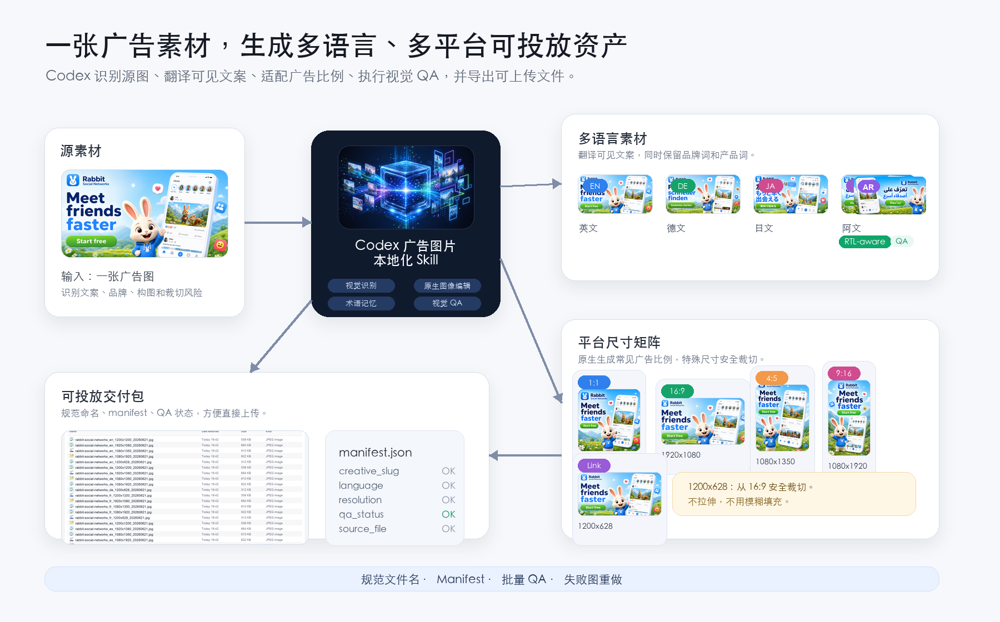
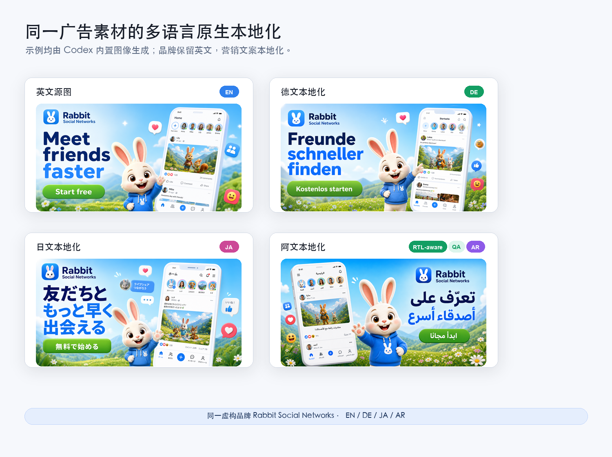

# 广告图片本地化 Codex Skill

**使用 Codex 内置图像生成能力进行广告图片本地化，不需要额外图片 API。**

[English](./README.md) · [安装说明](./install.md) · [Skill 文件](./SKILL.md) · [许可证](./LICENSE)

Ad Image Localization 是一个 Codex Skill，用于把源广告图片素材处理成可直接投放的多语言广告和社交平台素材。它适合市场、投放、运营、电商和创作者，用来批量生成多语言、多尺寸创意。



## 核心卖点

- **使用 Codex 订阅额度**进行图片生成和编辑。
- **不需要额外 API 配置**：不需要图片 API Key，不需要单独的计费账户，也不需要接入额外生成服务。
- **原生视觉效果**：优先使用 Codex 内置视觉理解、图像生成和图像编辑，而不是简单蒙版换字或机械拉伸。
- **适合投放工作流**：规范命名、manifest、常见广告尺寸、交付前视觉 QA。
- **适合长期跑任务**：虽然速度不如专门的批量图片 API，但配置成本低、质量好、综合性价比高，适合市场同学后台长期跑。

## 取舍

Codex 内置图像流程相对慢，不适合追求极限吞吐量的场景。这个 Skill 优先优化的是低配置成本、原生视觉质量和可交付性。

未来可能会更新另一个基于 Nano Banana API 的高吞吐版本，用于更快的大批量产出。

## 能做什么

- 翻译图片中的可见文字。
- 保留品牌名、产品名、Logo、主体和视觉层级。
- 输出常见广告/社交尺寸：
  - `1200x1200`
  - `1920x1080`
  - `1080x1350`
  - `1080x1920`
  - `1200x628`
- 对特殊分辨率，先生成最接近且安全的常见比例，再用确定性等比裁切处理。
- 维护品牌/产品术语记忆。
- 输出规范命名的文件和 manifest。
- 交付前进行视觉 QA，不合格图片会尝试重做一次。
- 内置确定性辅助脚本，用于安全裁切、manifest、文件名/尺寸检查、QA 总览图和术语记忆更新。


## 它有什么不同

这不是一个通用的图片翻译工具。

大多数图片翻译项目主要关注 OCR、文字擦除、翻译和重新渲染。而这个 skill 更关注 **广告创意本地化交付**：翻译图片中的营销文案，保留品牌词和产品词，适配常见广告尺寸，生成可直接上传的文件命名，输出 manifest，并在 Codex 工作流中完成视觉 QA。



## 辅助脚本

仓库内置的 Python 辅助脚本只处理确定性的交付收尾工作。它**不会**调用图片 API，也不会替代 Codex 内置图像生成。

```bash
python -m pip install -r requirements.txt
python scripts/ad_image_localization_tools.py cover-crop input.png output.jpg --size 1200x628
python scripts/ad_image_localization_tools.py manifest localized_output/
python scripts/ad_image_localization_tools.py verify localized_output/
python scripts/ad_image_localization_tools.py contact-sheet localized_output/ qa_contact_sheet.jpg
python scripts/ad_image_localization_tools.py memory-add brand_term_memory.json --brand openai --term Codex --action preserve
```

建议在模型原生生成之后使用它，完成可复用的安全裁切、manifest、文件名/尺寸检查、视觉 QA 总览图，以及品牌/产品术语记忆维护。脚本依赖 Pillow；如果不使用 Codex 自带 Python 运行时，本地可用 `python -m pip install -r requirements.txt` 安装依赖。

本地辅助脚本测试：

```bash
python -m pip install -r requirements.txt
python -m unittest discover -s tests
```

## 安装

直接安装到 Codex skills 目录：

```bash
mkdir -p "${CODEX_HOME:-$HOME/.codex}/skills"
git clone https://github.com/kouzt123/ad-image-localization-codex \
  "${CODEX_HOME:-$HOME/.codex}/skills/ad-image-localization"
```

如果你想把仓库放在其他位置，可以用软链接：

```bash
git clone https://github.com/kouzt123/ad-image-localization-codex ~/Developer/ad-image-localization-codex
mkdir -p "${CODEX_HOME:-$HOME/.codex}/skills"
ln -sfn ~/Developer/ad-image-localization-codex \
  "${CODEX_HOME:-$HOME/.codex}/skills/ad-image-localization"
```

如果你的 Codex 环境需要刷新 Skill，安装后重启或刷新一次即可。

更多说明见 [install.md](./install.md)。

## 使用示例

在 Codex 中明确调用这个 Skill：

```text
使用 ad-image-localization，把这张游戏广告翻译成德语、法语、西班牙语、日语、韩语，并输出 1200x1200、1920x1080、1080x1350、1080x1920 和 1200x628。
```

其他示例：

```text
把这张海报本地化成阿拉伯语和越南语。产品名保持英文，1200x628 不要拉伸文字。
```

```text
记住 OpenAI 相关素材里，Codex 不需要翻译。
```

## Prompt Cookbook

### 游戏广告

```text
使用 ad-image-localization，把这张游戏广告本地化成德语、西班牙语、日语和阿拉伯语。保留游戏标题，翻译所有角色属性和 UI 标签，并输出 1200x1200、1920x1080、1080x1350、1080x1920 和 1200x628。
```

### 电商商品图

```text
使用 ad-image-localization，生成这张商品 banner 的法语和葡萄牙语版本。品牌名保持不变，本地化优惠文案，并输出 Meta feed、story 和 1200x628 link-ad 尺寸。
```

### SaaS Banner

```text
使用 ad-image-localization，把这个 SaaS 发布 banner 本地化成日语和韩语。保持产品 UI 可读，保留 logo，并生成 16:9 和带安全边的 1200x628。
```

### App Store / 社媒截图

```text
使用 ad-image-localization，把这些 app 截图做成印尼语和越南语投放素材。翻译可见营销文案，保持 UI 标签自然，并输出规范文件名和 manifest.json。
```

## 尺寸处理

以 `1200x628` 为例，推荐流程是：

1. 先让模型生成带上下安全边的 `16:9` 版本。
2. 将 `1920x1080` 等比缩放到 `1200x675`。
3. 再裁掉上下多余像素，得到 `1200x628`。

这样可以保持几何比例，避免非等比压缩导致文字或主体变形。

辅助脚本已经把这个逻辑做成可复用命令：

```bash
python scripts/ad_image_localization_tools.py cover-crop 1920x1080.png 1200x628.jpg --size 1200x628
```

## 术语记忆

Skill 支持用 JSON 文件保存用户确认过的术语规则：

```json
{
  "version": 1,
  "brands": {
    "example-brand": {
      "display_name": "Example Brand",
      "rules": [
        {"term": "Example Brand", "action": "preserve"}
      ],
      "products": {}
    }
  }
}
```

品牌级规则适用于该品牌下的所有产品。产品级规则可以覆盖品牌级规则。

## 仓库结构

```text
ad-image-localization-codex/
├── SKILL.md
├── README.md
├── README.zh-CN.md
├── install.md
├── LICENSE
├── requirements.txt
├── scripts/
│   └── ad_image_localization_tools.py
├── tests/
├── examples/
├── brand_term_memory.json
└── agents/
    └── openai.yaml
```

## 许可证

MIT。见 [LICENSE](./LICENSE)。
